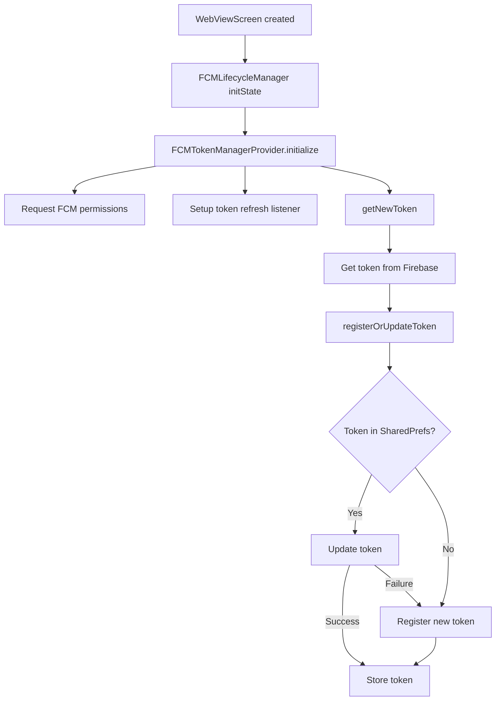
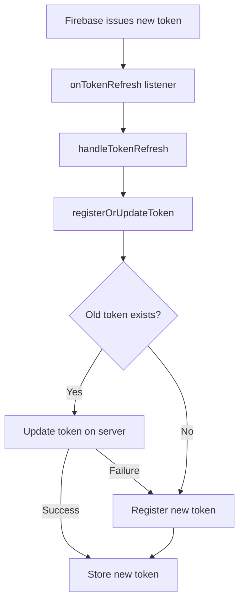
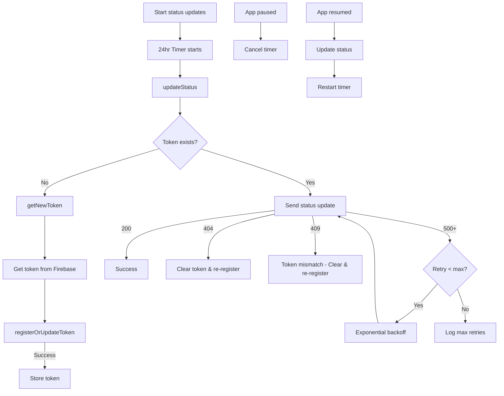
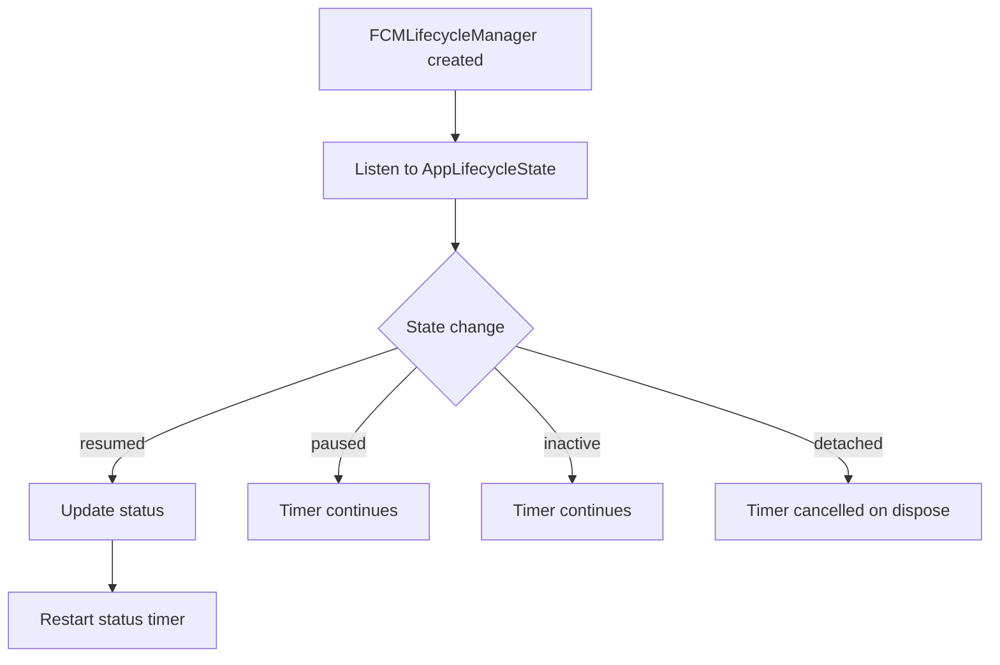

# FCM Integration Plan for BMB Mobile

## 1. Initial Setup
- [X] Create Firebase project
- [X] Configure Android/iOS apps in Firebase Console
- [X] Add Firebase configuration files
- [X] Update build files for both platforms
- [X] Add required dependencies:
  - firebase_core
  - firebase_messaging
  - flutter_local_notifications
  - device_info_plus

## 2. Database Infrastructure
- [X] Create new `wp_fcm_devices` table
  - user_id
  - device_id
  - token
  - platform
  - app_version
  - last_used
  - created_at
- [X] Set up proper indexes and constraints
- [X] Create PHP management class for device operations
  - Manage device preferences
  - Filter devices based on notification type
  - Handle token validation
  - Manage device status
  - Support notification targeting
  - Handle delivery failures

## 3. WordPress Backend
- [ ] Install/configure FCM WordPress plugin
- [X] Create REST API endpoints for:
  - Token registration
  - Token updates
  - Device management
  - Notification preferences
- [X] Integrate with existing notification system
- [X] Set up token cleanup routines

## 4. App Modifications
- [X] Initialize Firebase in main.dart
- [X] Request notification permissions
- [X] Implement token management system
- [X] Handle token refresh events
- [X] Create device identification system
- [X] Integrate with WordPress API endpoints

## 5. Token Management System
- [X] Implement device registration flow
- [X] Handle token refreshes
- [X] Manage multiple devices per user
- [X] Clean up invalid/old tokens
- [X] Track token usage and validity

## 6. WebView Integration
- [ ] Bridge notifications with WebView content
- [ ] Handle deep linking from notifications
- [ ] Manage WebView state with notifications
- [ ] Coordinate with WordPress backend

## 7. Testing & Validation
- [ ] Test notification scenarios:
  - App foreground
  - App background
  - App terminated
  - Multiple devices
- [ ] Verify multi-device handling
- [ ] Test token refresh flows
- [ ] Validate permission handling
- [ ] Cross-platform testing

## 8. Deployment & Monitoring
- [ ] Create staged rollout plan
- [ ] Set up monitoring for:
  - Token management
  - Notification delivery
  - User engagement
  - Error cases

## Notes
- Maintain email notifications as fallback
- Consider implementing notification categories
- Plan for handling offline scenarios
- Consider implementing notification preferences UI

## Required WordPress REST API Endpoints

### 1. Token Registration
- **Endpoint**: `/wp-json/bmb/v1/fcm/register`
- **Method**: POST
- **Purpose**: Register new device token
- **Payload**:
  ```json
  {
    "token": "fcm_token",
    "device_id": "unique_device_identifier",
    "platform": "ios|android",
    "app_version": "1.0.0"
  }
  ```

### 2. Token Update
- **Endpoint**: `/wp-json/bmb/v1/fcm/update`
- **Method**: PUT
- **Purpose**: Update existing token for device
- **Payload**:
  ```json
  {
    "old_token": "old_fcm_token",
    "new_token": "new_fcm_token",
    "device_id": "unique_device_identifier"
  }
  ```

### 3. Device Deregistration
- **Endpoint**: `/wp-json/bmb/v1/fcm/deregister`
- **Method**: DELETE
- **Purpose**: Remove device token (logout/uninstall)
- **Payload**:
  ```json
  {
    "device_id": "unique_device_identifier"
  }
  ```

### 4. Device Status Update
- **Endpoint**: `/wp-json/bmb/v1/fcm/status`
- **Method**: POST
- **Purpose**: Update last_used timestamp
- **Payload**:
  ```json
  {
    "device_id": "unique_device_identifier",
    "token": "fcm_token"
  }
  ```

### 5. User Devices List
- **Endpoint**: `/wp-json/bmb/v1/fcm/devices`
- **Method**: GET
- **Purpose**: List all devices for current user
- **Response**:
  ```json
  {
    "devices": [
      {
        "device_id": "device_identifier",
        "platform": "ios|android",
        "last_used": "timestamp",
        "app_version": "1.0.0"
      }
    ]
  }
  ```

### 6. Notification Preferences
- **Endpoint**: `/wp-json/bmb/v1/fcm/preferences`
- **Method**: GET/POST
- **Purpose**: Manage notification preferences
- **Payload** (POST):
  ```json
  {
    "device_id": "unique_device_identifier",
    "preferences": {
      "tournaments": true,
      "messages": true,
      "updates": false
    }
  }
  ```

## Lifecycle Flows

### 1. Initialization Flow


### 2. Token Refresh Flow


### 3. Status Update Flow


### 4. App Lifecycle State Changes

